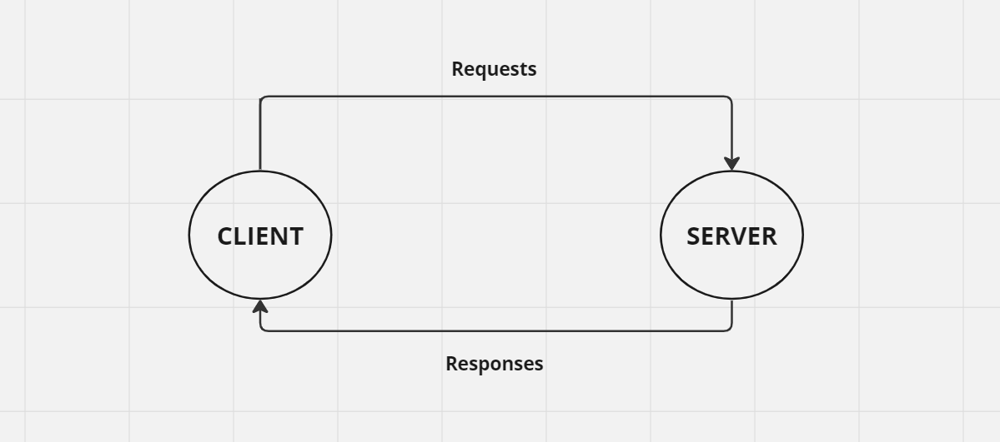
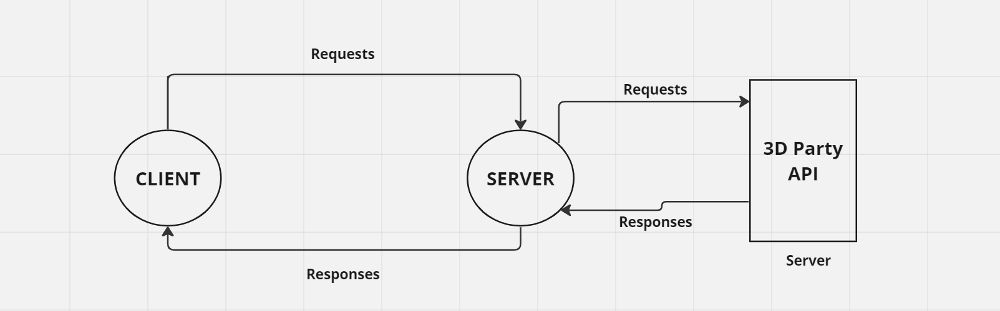

# Project Name - Project Version

**Author Name**: Abdel Rahman Radwan

## WRRC
LAB11:

LAB12:

## Overview
this project is a movie library app.
## Getting Started
1.clone this repo 
git clone "git@github.com:Abed1313/Movies-Library.git"

2.navigate to the project directory
cd Movies-Library

3.install the required dependencies
npm install

4.start the server 
npm start

5.open the web brawser and write this aderess 
http://localhost:3000/

6.now you can see your home page 

## Project Features
List Movie Recipes:
1.GET '/' for home page 
2.GET /favorite
3.Trending Page Endpoint: /trending
Fetches and displays trending movies of the week.

4.Search Page Endpoint: /search
Allows users to search for movies based on the provided query.

5.Popular Page Endpoint: /Popular
Fetches and displays Popular movies.

6.Countries Page Endpoint: /Countries
Fetches and displays Countries movies.

## Error Handling:
1.404 Not Found: Automatically handles any undefined routes with a JSON response indicating the error.
2.500 Internal Server Error: Captures and logs server errors, providing a JSON response for unexpected conditions.

## Technical Specifications:
1.Framework: Utilizes Express.js, a minimal and flexible Node.js web application framework.
2.Data Handling: Reads movie data from a local JSON file (movieData/data.json), simulating a database for simplicity.
3.Data Model: Uses a simple JavaScript constructor function (Recipe) to model each movie data entry.
4.Server: Configured to run on port 3000, making the application accessible locally for development and testing.

## Dependencies
Express
Cors
Axios
Dotenv

## API Key
Make sure to set up your API key in a .env file and name the variable API_KEY.
